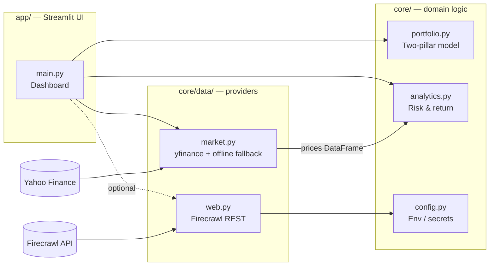

# Architecture — Rotshild Quant Dashboard

A Streamlit dashboard implementing a **bottom-up, two-pillar investment
approach**: *Return assets* to produce growth, *Diversifying assets* to
provide protection and diversification.

## System overview

## Layout

| Path | Responsibility | Rules |
| --- | --- | --- |
| `app/main.py` | Streamlit entry point; KPI row + three tabs (Market Overview, Quant Risk & CAPM, Rebalancing Engine) | No business logic — call into `core/` |
| `.streamlit/config.toml` | Institutional theme (navy primary, white bg) | Chart palette lives in `app/main.py` (`PALETTE`) |
| `core/portfolio.py` | `Asset`, `Pillar` (RETURN / DIVERSIFYING), `Portfolio`, drifted weights + rebalancing trades | Pure functions/dataclasses, no I/O |
| `core/analytics.py` | Returns, volatility, max drawdown, correlation, CAGR, Sharpe, Sortino, rolling CAPM beta/alpha | Pure functions over a wide price `DataFrame` (index=date, columns=tickers) or an index `Series` (start=1) |
| `core/data/market.py` | Price fetching via yfinance | Returns `(prices, is_live)`; falls back to seeded synthetic data on any failure so the UI always renders |
| `core/data/web.py` | Firecrawl `scrape()` / `search()` for news, filings, research | Raises `FirecrawlError` with a clear message when key missing or call fails |
| `core/config.py` | Loads `.env`, exposes `FIRECRAWL_API_KEY`, paths | Only place that touches `os.environ` |
| `data/` | Local cache (gitignored) | Never committed |
| `.devcontainer/` | Codespaces / Dev Container config | Python 3.12 + Node 22, auto-installs deps + firecrawl-cli, forwards port 8501 |

## Key contracts

- **Price data shape:** every provider returns a wide `pd.DataFrame` —
  `DatetimeIndex` rows, one column per ticker, adjusted close values.
  All of `core/analytics.py` operates on exactly this shape.
- **Portfolio weights:** fractions summing to 1.0; `Portfolio.validate()`
  enforces it. Pillar split is derived (`pillar_weight`), never stored.
- **Graceful degradation:** market data failures degrade to demo data
  (flagged via `is_live`); Firecrawl failures raise, and the UI decides
  how to surface them. The dashboard must always render.
- **Secrets:** only via `.env` (local) or Codespaces secrets — never in
  code or git. `core/config.py` is the single read point.

## Data flow

1. `app/main.py` builds a `Portfolio` (currently `demo_portfolio()`).
2. `fetch_prices(tickers + [benchmark], period)` returns adjusted closes
   (cached 1h via `st.cache_data`).
3. `analytics` computes the portfolio index, KPIs vs benchmark (CAGR, max
   drawdown, Sharpe, Sortino), rolling CAPM beta/alpha, per-asset stats,
   and the correlation matrix.
4. `rebalancing_trades()` derives drifted current weights vs target and
   the trades to close the gap (exportable as CSV).
5. Optional: `core/data/web.py` pulls news / filings text via Firecrawl for
   a future Research page.

## Design language

Institutional private-banking aesthetic: deep navy (`#1B2A4A`), charcoal
text, white background, soft gold accents (`#C9A227`); chart series use a
color-blind-friendly institutional set (navy, slate blue `#5B7DB1`, muted
teal `#3E7C7B`, soft gold, silver `#8B90A0`). Typography is Streamlit's
default sans-serif. Theme lives in `.streamlit/config.toml`; keep chart
colors in `PALETTE` in `app/main.py` so they stay consistent across tabs.

## Roadmap (suggested next steps)

- `app/pages/1_Research.py` — Firecrawl-powered news & filings per holding
- Editable holdings (replace `demo_portfolio()` with a YAML/JSON config in
  the repo, or a Streamlit data editor + persistence)
- Bilingual EN/DE toggle (simple dict-based i18n in `app/`)
- Avaloq/VBA export tab (structured trade file beyond the current CSV)
- Price cache in `data/` (parquet) to cut yfinance calls
- `tests/` — start with `analytics` (pure functions, easy wins)
- Firecrawl `monitor` for filings/news alerts on portfolio names
